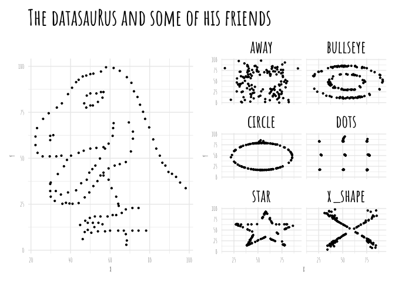

<!-- README.md is generated from README.Rmd. Please edit that file -->

# Graphs

<!-- badges: start -->
<!-- badges: end -->

Graphs is a personal package and a vehicle for graphs made with R.

## Installation

You can install the development version of Graphs from
[GitHub](https://github.com/) with:

``` r
# install.packages("devtools")
devtools::install_github("edgar-treischl/Graphs")
```

## Example

This is a basic example which shows that the `plotgraph()` returns
graphs made with R. For example, the `datasaurus` plot.

``` r
library(Graphs)
## basic example code
plotgraph("datasaurus.R")
```



Without input, the `plotgraph()` function returns all available graphs.

``` r
plotgraph()
#> Error in plotgraph(): Please run `plotgraph()` with a valid argument.
#> Valid examples are:
#> anscombe_quartet.R
#> boxplot_illustration.R
#> boxplot_pitfalls.R
#> data_joins.R
#> datasaurus.R
#> gapminder.R
#> pacman.R
#> simpson.R
#> ucb_admission.R
```

Or use the code from the repository.

``` r
library(datasauRus)
library(ggplot2)
library(dplyr)
library(showtext)
library(patchwork)

font_add_google("Amatic SC", "Amatic+SC")
## Automatically use showtext to render text for future devices
showtext_auto()

#distinct(datasaurus_dozen, dataset)

 dino <- filter(datasaurus_dozen, dataset == "dino" )
  
  p1 <- ggplot(dino, aes(x = x, y = y)) +
    geom_point(size = .75) +
    theme(legend.position = "none") +
    theme_minimal()+
    theme(text=element_text(size=10,  family="Amatic+SC"))+
    labs(title = "The Datasaur and some of his friends")+
    theme(plot.title = element_text(size=28, face = "bold"))+
    theme(strip.text.x = element_text(
      size = 22, color = "black", face = "bold"
    ))
  
  
  datasaurus_dozen2 <- filter(datasaurus_dozen, dataset == "away" |
                                dataset == "bullseye" |
                                dataset == "circle" |
                                dataset == "dots" |
                                dataset == "star" |
                                dataset == "x_shape" 
  )
  
  
  p2 <- ggplot(datasaurus_dozen2, aes(x = x, y = y)) +
    geom_point(size = .75) +
    theme(legend.position = "none") +
    facet_wrap(~dataset, ncol = 2)+
    theme_minimal()+
    theme(text=element_text(size=10,  family="Amatic+SC"))+
    theme(strip.text.x = element_text(
      size = 22, color = "black", face = "bold"
    ))
  
  
  p1+p2
```
